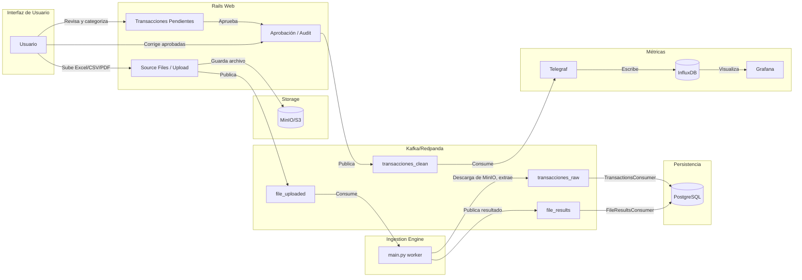

# Arquitectura: Personal Observability Pipeline (Audit-X)

*Actualizado: febrero 2026*

## Flujo de datos

## Componentes

| Componente | Responsabilidad |
|------------|-----------------|
| **Rails (web)** | UI de carga de archivos, listado de transacciones pendientes, aprobación manual, correcciones en lote (audit), motor de reglas. Publica en `file_uploaded` y `transacciones_clean`. |
| **MinIO** | Almacenamiento de archivos subidos (Excel, CSV, PDF). Los archivos no se guardan en el filesystem de los contenedores. |
| **Python (ingestion_worker)** | Consumidor de `file_uploaded`. Descarga de MinIO, ejecuta extractor según banco, publica en `transacciones_raw` y `file_results`. |
| **Karafka (Rails)** | Consumidor de `transacciones_raw` y `file_results`. Persiste en PostgreSQL. |
| **Telegraf** | Consumidor de `transacciones_clean`. Escribe en InfluxDB. |
| **InfluxDB** | Base de métricas de tiempo. Fuente de datos para Grafana. |
| **Grafana** | Dashboards y visualización. |

## Tópicos Kafka

| Tópico | Producer | Consumer | Rol |
|--------|----------|----------|-----|
| `file_uploaded` | Rails (ExcelUploaderService) | Python (main.py) | Notifica que hay un archivo listo para procesar. |
| `transacciones_raw` | Python | Rails (TransactionsConsumer) | Transacciones extraídas de archivos. |
| `transacciones_clean` | Rails (Transaction#publish_clean_event) | Telegraf | Transacciones aprobadas para InfluxDB. |
| `file_results` | Python (send_feedback) | Rails (FileResultsConsumer) | Resultado del procesamiento (éxito, error, count). |
| `domain_events` | Rails (DomainEventPublishable) | Opcional | Auditoría y reconstrucción. |

## Principios de diseño

- **Desacoplamiento:** Los servicios se comunican solo vía Kafka o URIs de MinIO.
- **Gestión de archivos:** Todo va a MinIO; no se guarda en el filesystem de los contenedores.
- **Idempotencia:** El `event_id` (hash determinista) previene duplicados en transacciones.
- **Aprobación manual:** Ninguna transacción llega a InfluxDB sin ser revisada y aprobada en la UI.
