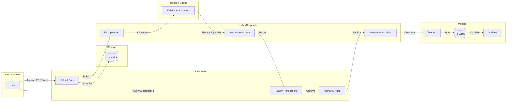

# Audit-X: Personal Finance Observability Pipeline

[](https://github.com/fedegos/personal-obs-pipeline/actions/workflows/ci.yml)


## What is Audit-X?

Audit-X is a **personal finance observability system** that transforms your bank statements into actionable insights. Instead of manually tracking expenses in spreadsheets or relying on bank apps with limited analytics, Audit-X gives you complete control over your financial data with powerful visualization and analysis tools.

### The Problem

Managing personal finances across multiple banks and credit cards is tedious:
- Bank apps show transactions but offer poor categorization and no cross-bank analysis
- Spreadsheets require manual data entry and become unmaintainable
- You can't easily answer questions like "How much did I spend on subscriptions across all cards?" or "What's my spending trend by category over the past 6 months?"
- There's no audit trail of when transactions were reviewed or modified

### The Solution

Audit-X provides an **event-driven pipeline** that:
1. **Extracts** transactions from PDF/Excel bank statements automatically
2. **Categorizes** expenses using customizable regex-based rules
3. **Tracks sentiment** (Necessary vs Desire) to understand spending behavior
4. **Requires manual approval** before data enters your metrics — you stay in control
5. **Visualizes** trends across time, categories, payment methods, and more in Grafana dashboards
6. **Maintains an immutable event store** for full auditability and replay capability

### Key Features

- **Multi-bank support**: BBVA, Banco Provincia, American Express, and more
- **Smart categorization**: Rules engine with regex patterns, priorities, and inheritance
- **Human-in-the-loop**: Every transaction requires approval before entering metrics
- **Time-series analytics**: Track spending patterns over any time range
- **Event sourcing**: Full history of all changes, with replay and projection capabilities
- **Self-hosted**: Your financial data stays on your infrastructure

### Why Not Just Use...?

| Alternative | Limitation | Audit-X Advantage |
|-------------|------------|-------------------|
| **YNAB / Mint** | Requires bank credentials or API access | Works with exported statements — no credential sharing |
| **Excel / Google Sheets** | Manual data entry, no automation | Automatic PDF/Excel extraction |
| **Bank Apps** | Single bank view, limited categorization | Cross-bank analysis with custom rules |
| **Firefly III** | No time-series analytics, no approval workflow | InfluxDB + Grafana for deep analysis, human-in-the-loop |

### Use Cases

Audit-X helps you answer questions like:

- 📊 "How much did I spend on **delivery** this year vs last year?"
- 📈 "What's my **monthly trend** for each spending category?"
- 🎯 "What percentage of my expenses are **desires** vs **necessities**?"
- 💳 "Which **credit card** am I using most for subscriptions?"
- 🔍 "When did I **approve** that transaction and with what category?"

## Screenshots

> 📸 *Coming soon: Screenshots of the transaction approval UI and Grafana dashboards*

<!-- 
TODO: Add screenshots


-->

## Architecture



## Tech Stack

| Component | Technology | Purpose |
|-----------|------------|---------|
| Web UI | Ruby on Rails 8.1 | Transaction management, category rules, approval workflow |
| Message Broker | Redpanda (Kafka-compatible) | Event-driven communication between services |
| Ingestion | Python 3.11 | PDF/Excel extraction (pdfplumber, pandas) |
| Time-series DB | InfluxDB 2.7 | Financial metrics storage |
| Visualization | Grafana | Dashboards and analytics |
| Object Storage | MinIO | S3-compatible file storage |
| Database | PostgreSQL 15 | Transactional data |

## Supported Banks

| Bank | Format | Network | Fields Extracted | Notes |
|------|--------|---------|------------------|-------|
| BBVA Argentina | PDF | Visa | Date, amount, description, installments | Monthly statement |
| BBVA Argentina | PDF | Mastercard | Date, amount, description, installments | Monthly statement |
| Banco Provincia | PDF | Visa | Date, amount, description | Monthly statement |
| Banco Provincia | PDF | Mastercard | Date, amount, description | Monthly statement |
| American Express | PDF | Amex | Date, amount, description | Monthly statement |
| American Express | Google Sheets | Amex | Date, amount, description | Real-time export |
| Generic | Excel/CSV | Any | Configurable columns | Custom mapping |

> 💡 **Adding a new bank?** See [CONTRIBUTING.md](CONTRIBUTING.md) for the extractor development guide.

## Quick Start

```bash
# 1. Clone and configure
git clone https://github.com/fedegos/personal-obs-pipeline.git
cd personal-obs-pipeline
cp .env.example .env
# Edit .env with your credentials

# 2. Start all services
docker compose up -d

# 3. Access the UI
open http://localhost:3000
```

## Documentation

- [Operations Runbook](DOCS/OPERATIONS.md) - Daily operations, troubleshooting, Makefile commands
- [Architecture](DOCS/ARCHITECTURE.md) - System design and data flow
- [AsyncAPI Spec](DOCS/asyncapi.yaml) - Kafka topics and event schemas
- [Event Repository](DOCS/EVENT-REPOSITORY-DESIGN.md) - Immutable event store design

## Development

```bash
# Run all tests
make test

# Run only Rails tests
make test-rails

# Run only Python tests
make test-python

# Lint and security checks
make ci
```

## Roadmap

- [ ] **More banks**: Santander, Galicia, ICBC extractors
- [ ] **Mobile app**: React Native companion for quick approvals
- [ ] **Budget alerts**: Telegram/Slack notifications when category exceeds threshold
- [ ] **Receipt OCR**: Extract data from receipt photos
- [ ] **Multi-currency**: Support USD transactions with historical conversion
- [ ] **Shared expenses**: Split transactions between family members

## Contributing

Contributions are welcome! See [CONTRIBUTING.md](CONTRIBUTING.md) for guidelines on:
- Adding new bank extractors
- Improving categorization rules
- Enhancing Grafana dashboards

## License

Private project - All rights reserved.
